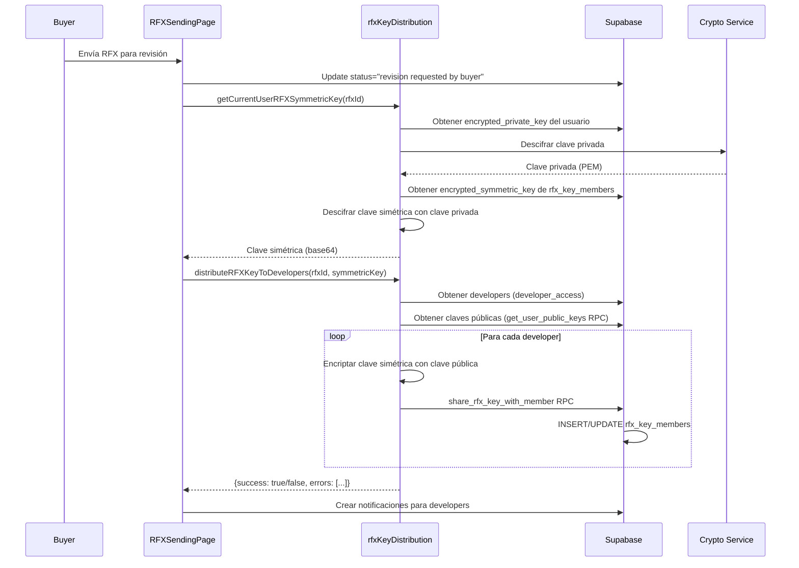
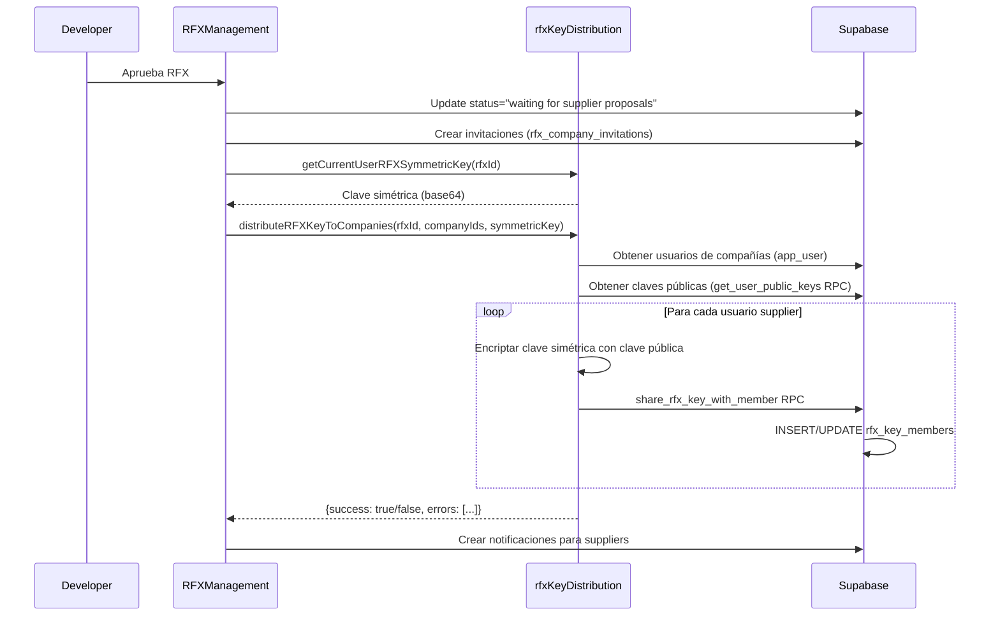

# Implementación de Distribución de Claves RFX

## Resumen

El sistema distribuye automáticamente la clave simétrica de cifrado de una RFX en dos momentos clave del flujo:

1. **Cuando el buyer envía la RFX para revisión** → Se distribuye la clave a **todos los developers de FQ Source**
2. **Cuando un developer aprueba la RFX** → Se distribuye la clave a **todos los usuarios de las compañías suppliers invitadas**

Esto permite que los revisores y suppliers puedan acceder al contenido cifrado de la RFX de forma segura.

## Flujo Completo

```
Buyer crea RFX (draft)
    ↓
Buyer envía para revisión → [DISTRIBUCIÓN A DEVELOPERS]
    ↓ (status: "revision requested by buyer")
Developers revisan contenido cifrado
    ↓
Developer aprueba RFX → [DISTRIBUCIÓN A SUPPLIERS]
    ↓ (status: "waiting for supplier proposals")
Suppliers acceden a contenido cifrado
```

## Componentes Implementados

### 1. Módulo de Distribución de Claves (`src/lib/rfxKeyDistribution.ts`)

Este módulo proporciona tres funciones principales:

#### `getCurrentUserRFXSymmetricKey(rfxId: string): Promise<string | null>`

Obtiene la clave simétrica de la RFX del usuario actual en formato base64. Esta función:
- Obtiene la clave privada del usuario desde la base de datos
- La descifra usando el servidor de criptografía
- Obtiene la clave simétrica encriptada de la RFX desde `rfx_key_members`
- Descifra la clave simétrica con la clave privada del usuario
- Exporta la clave simétrica a formato base64 para facilitar su redistribución

#### `distributeRFXKeyToDevelopers(rfxId, symmetricKeyBase64): Promise<{success, errors}>`

**Usado en el primer envío de la RFX**

Distribuye la clave simétrica de la RFX a todos los developers de FQ Source. Esta función:
1. Obtiene todos los usuarios con acceso de developer desde la tabla `developer_access`
2. Recupera las claves públicas de esos developers usando la función RPC `get_user_public_keys`
3. Para cada developer con clave pública:
   - Encripta la clave simétrica con la clave pública del developer
   - Guarda la entrada en `rfx_key_members` usando la función RPC `share_rfx_key_with_member`
4. Retorna un resumen de éxito y una lista de errores (si hubo alguno)

#### `distributeRFXKeyToCompanies(rfxId, companyIds, symmetricKeyBase64): Promise<{success, errors}>`

**Usado cuando se aprueba la RFX**

Distribuye la clave simétrica de la RFX a todos los usuarios de las compañías suppliers especificadas. Esta función:
1. Obtiene todos los usuarios de las compañías especificadas desde la tabla `app_user`
2. Recupera las claves públicas de esos usuarios usando la función RPC `get_user_public_keys`
3. Para cada usuario con clave pública:
   - Encripta la clave simétrica con la clave pública del usuario
   - Guarda la entrada en `rfx_key_members` usando la función RPC `share_rfx_key_with_member`
4. Retorna un resumen de éxito y una lista de errores (si hubo alguno)

### 2. Integración en RFXSendingPage (Primera vez - Distribución a Developers)

La distribución de claves a developers se ejecuta automáticamente cuando:
- El buyer envía la RFX por primera vez para revisión
- El flujo completo es:
  1. Se valida la RFX
  2. Se actualiza el status a "revision requested by buyer"
  3. **[NUEVO]** Se distribuyen las claves de cifrado a todos los developers de FQ Source
  4. Se envían notificaciones a los developers

**Ubicación:** `src/pages/RFXSendingPage.tsx`, líneas ~958-1007

**Importante:** En actualizaciones posteriores (cuando la RFX ya está enviada), NO se distribuyen claves nuevamente. Solo se notifica a los suppliers existentes sobre cambios en las especificaciones.

### 3. Integración en RFXManagement (Aprobación - Distribución a Suppliers)

La distribución de claves a suppliers se ejecuta automáticamente cuando:
- Un developer de FQ Source aprueba una RFX y la marca como "waiting for supplier proposals"
- El flujo completo es:
  1. Developer revisa y aprueba la RFX
  2. Se crean invitaciones para las compañías seleccionadas
  3. **[NUEVO]** Se distribuyen las claves de cifrado a todos los usuarios de esas compañías
  4. Se envían notificaciones y emails a las compañías

**Ubicación:** `src/pages/RFXManagement.tsx`, líneas ~940-964

## Flujo de Datos

### Fase 1: Envío para Revisión (Buyer → Developers)



### Fase 2: Aprobación y Distribución a Suppliers (Developer → Suppliers)



## Seguridad

### Políticas RLS

Las políticas de Row Level Security están configuradas para:
- Permitir que el creador de la RFX comparta claves (`rfxs.user_id = auth.uid()`)
- Permitir que cualquier miembro existente de la RFX comparta claves (existe en `rfx_key_members`)
- Usar `SECURITY DEFINER` en las funciones RPC para garantizar que las operaciones se ejecuten con privilegios elevados

**Migración relevante:** `supabase/migrations/20251125111253_fix_rfx_key_member_policy.sql`

### Cifrado de Extremo a Extremo (E2EE)

1. **Generación:** Cada RFX tiene una clave simétrica única (AES-256-GCM)
2. **Almacenamiento:** La clave se almacena encriptada con la clave pública RSA-4096 de cada usuario
3. **Transmisión:** Solo se transmiten claves encriptadas; las claves privadas nunca salen del dispositivo del usuario (excepto para ser cifradas por el servidor maestro)
4. **Descifrado:** Cada usuario descifra la clave simétrica con su clave privada para acceder al contenido

## Manejo de Errores

El sistema está diseñado para ser resiliente:
- Si un usuario no tiene clave pública, se registra como warning y se continúa con los demás
- Si falla la distribución de claves, se muestra un toast de advertencia pero no se bloquea el envío de la RFX
- Todos los errores se loguean detalladamente para depuración

## Testing Recomendado

1. **Escenario 1: Primer envío (Distribución a Developers)**
   - Crear una RFX como buyer
   - Completar las especificaciones
   - Seleccionar candidatos
   - Enviar para revisión (status → "revision requested by buyer")
   - **Verificar:** Todos los developers tienen entradas en `rfx_key_members` para esta RFX
   - **Verificar:** Los developers pueden acceder y ver el contenido cifrado

2. **Escenario 2: Aprobación de Developer (Distribución a Suppliers)**
   - Como developer, revisar la RFX del escenario 1
   - Aprobar la RFX (status → "waiting for supplier proposals")
   - **Verificar:** Todos los usuarios de las compañías seleccionadas tienen entradas en `rfx_key_members`
   - **Verificar:** Los suppliers pueden acceder y ver el contenido cifrado

3. **Escenario 3: Developer sin claves**
   - Agregar un nuevo developer sin `public_key` en `app_user`
   - Enviar una RFX para revisión
   - **Verificar:** El sistema continúa funcionando y registra un warning
   - **Verificar:** Otros developers con claves sí reciben acceso

4. **Escenario 4: Supplier sin claves**
   - Invitar a una compañía con un usuario que no tenga `public_key` en `app_user`
   - Aprobar la RFX como developer
   - **Verificar:** El sistema continúa funcionando y registra un warning
   - **Verificar:** Otros usuarios de la misma compañía con claves sí reciben acceso

5. **Escenario 5: Actualización de especificaciones**
   - En una RFX ya aprobada, actualizar las especificaciones
   - Re-enviar la RFX
   - **Verificar:** NO se distribuyen nuevas claves (solo notificaciones)
   - **Verificar:** Los usuarios existentes aún pueden acceder al contenido actualizado

## Logs y Monitoreo

El sistema genera logs detallados con prefijos identificables:

### Logs de Envío (RFXSendingPage)
- `🔐 [RFX Sending]` - Inicio de distribución a developers
- `✅ [RFX Sending]` - Distribución exitosa a developers
- `⚠️ [RFX Sending]` - Advertencias durante distribución
- `❌ [RFX Sending]` - Errores durante distribución

### Logs de Aprobación (RFXManagement)
- `🔐 [RFX Management]` - Inicio de distribución a suppliers
- `✅ [RFX Management]` - Distribución exitosa a suppliers
- `⚠️ [RFX Management]` - Advertencias durante distribución
- `❌ [RFX Management]` - Errores durante distribución

### Logs de Distribución (rfxKeyDistribution)
- `🔑 [RFX Key Distribution]` - Inicio de distribución (general)
- `👥 [RFX Key Distribution]` - Conteo de usuarios/developers
- `🔐 [RFX Key Distribution]` - Operaciones de cifrado
- `✅ [RFX Key Distribution]` - Operaciones exitosas por usuario
- `⚠️ [RFX Key Distribution]` - Advertencias (usuarios sin claves)
- `❌ [RFX Key Distribution]` - Errores fatales

## Dependencias

- `supabase/functions/crypto-service` - Servicio de cifrado maestro
- Función RPC `get_user_public_keys` - Obtiene claves públicas de usuarios
- Función RPC `share_rfx_key_with_member` - Guarda claves encriptadas
- Tabla `rfx_key_members` - Almacena las claves encriptadas por usuario
- Hook `useRFXCrypto` - Manejo de cifrado en el cliente

## Próximos Pasos

- [ ] Implementar rotación de claves para RFX actualizadas
- [ ] Agregar auditoría de acceso a claves
- [ ] Considerar caché de claves públicas para mejorar performance
- [ ] Implementar limpieza de claves cuando se elimina un usuario de una compañía

